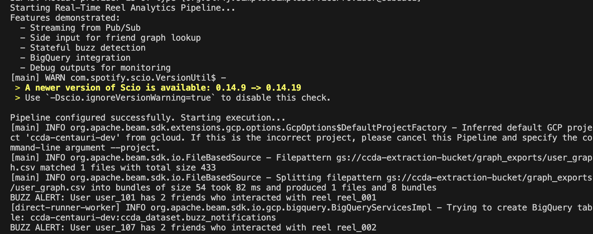

# RealTimeAnalytics

## Overview

RealTimeAnalytics is a **product analytics data pipeline playground** built with Apache Beam and Scio. This repository serves as a sandbox for experimenting with various real-time streaming analytics use cases, from social media engagement tracking to user behavior analysis leveraging scala data pipelines along my learning path to integrate different product use cases and business problems.

## Features

This project demonstrates advanced streaming concepts including:

- **Real-time Pub/Sub ingestion** from Google Cloud Pub/Sub
- **Multiple windowing strategies** (Fixed, Sliding, Session windows)
- **Side input processing** for efficient graph lookups
- **Complex aggregations** and transformations
- **Streaming analytics** with Apache Beam runners
- **BigQuery integration** for results storage

## Architecture

The pipeline processes interaction events (likes, comments) in real-time:
1. **Ingest** events from Pub/Sub subscription
2. **Filter** high-quality interactions (likes with >2s watch time, comments)
3. **Enrich** with friend relationships using side input
4. **Detect buzz** when 2+ friends interact with same reel
5. **Output** notifications to BigQuery



## Quick Start

### Prerequisites
- Java 11+
- SBT 1.10+
- Google Cloud credentials configured

### Local Development
```bash
# Compile the project
sbt compile

# Run locally with DirectRunner
sbt "runMain dataengineering.BuzzDetectionJob \
  --inputSubscription=projects/YOUR_PROJECT_ID/subscriptions/reel_event-sub \
  --outputBQTable=YOUR_DATASET.buzz_notifications \
  --userGraphPath=gs://YOUR_BUCKET/graph_exports/user_graph.csv"
```

### Google Cloud Dataflow
```bash
sbt "runMain dataengineering.BuzzDetectionJob \
  --runner=DataflowRunner \
  --project=YOUR_PROJECT_ID \
  --region=YOUR_REGION \
  --inputSubscription=projects/YOUR_PROJECT_ID/subscriptions/reel_event-sub \
  --outputBQTable=YOUR_DATASET.buzz_notifications \
  --userGraphPath=gs://YOUR_BUCKET/graph_exports/user_graph.csv"
```

## Configuration

### Required Arguments
- `--inputSubscription`: Pub/Sub subscription path
- `--outputBQTable`: BigQuery table for results
- `--userGraphPath`: GCS path to user graph CSV file

### Optional Arguments
- `--runner`: Beam runner (DirectRunner, DataflowRunner, etc.)
- `--project`: Google Cloud project ID
- `--region`: Google Cloud region

## Project Structure

```
src/main/scala/dataengineering/
├── BuzzDetectionJob.scala    # Main streaming pipeline
├── models/
│   └── Models.scala          # Data models and BigQuery schemas
└── options/
    └── PipelineArgs.scala    # Command-line argument parsing
```

## Dependencies

- **Scio**: 0.14.9 (Apache Beam wrapper)
- **Apache Beam**: 2.60.0 (Streaming framework)
- **Circe**: 0.14.9 (JSON parsing)
- **Google Cloud Platform**: Pub/Sub, BigQuery, Dataflow

---

This project is based on the [scio.g8](https://github.com/spotify/scio.g8) template.
